# Template de integração do Sistema Logístico

## Introdução

Este projeto tem o intuíto de ser usado como base para o desenvolvimento de integrações com o Sistema Logístico da Glok.

## Tecnologias e bibliotecas usadas neste template:

- C#
- .Net Core 6.0
- Banco SQL Server (Usado para exemplificar a conexão com o banco de dados)

## Como usar

1. Modifique o arquivo `appsettings.json`, com as suas credenciais e configurações:

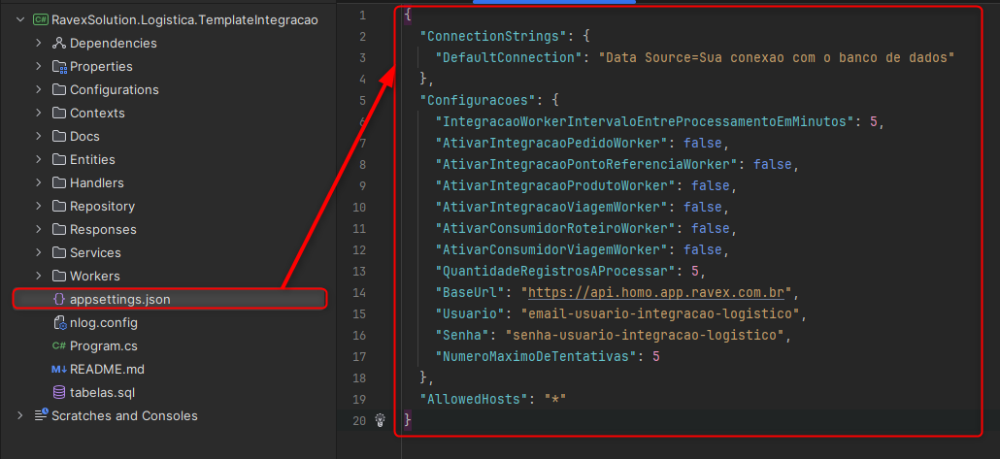

- `DefaultConnection`: String de conexão com seu banco de dados.
- `IntegracaoWorkerIntervaloEntreProcessamentoEmMinutos`: De quanto em quanto tempo o serviço será executado.
- `AtivarIntegracaoPedidoWorker`: Quando for verdadeiro, o worker IntegracaoPedido estará desativado.
- `AtivarIntegracaoPontoReferenciaWorker`: Quando for verdadeiro, o worker IntegracaoPontoReferencia estará desativado.
- `AtivarIntegracaoProdutoWorker`: Quando for verdadeiro, o worker IntegracaoProduto estará desativado.
- `AtivarIntegracaoViagemWorker`: Quando for verdadeiro, o worker IntegracaoViagem estará desativado.
- `AtivarConsumidorRoteiroWorker`: Quando for verdadeiro, o worker ConsumidorRoteiro estará desativado.
- `AtivarConsumidorViagemWorker`: Quando for verdadeiro, o worker ConsumidorViagem estará desativado.
- `QuantidadeRegistrosAProcessar`: Quantidade de registros que serão obtidos nas buscas.
- `BaseUrl`: URL base da API do Sistema Logístico.
- `Usuario`: Usuário de acesso ao Sistema Logístico. Substitua pelo usuário fornecido pela Glok.
- `Senha`: Senha de acesso ao integração. Substitua pela senha fornecida pela Glok.
- `NumeroMaximoDeTentativas`: Quantidade de vezes em que o sistema tentará fazer a integração de algum dado antes de ser ignorado.

2. Observe que abaixo, temos um exemplo de estrutura de tabelas para utilizar o nosso template de integração.

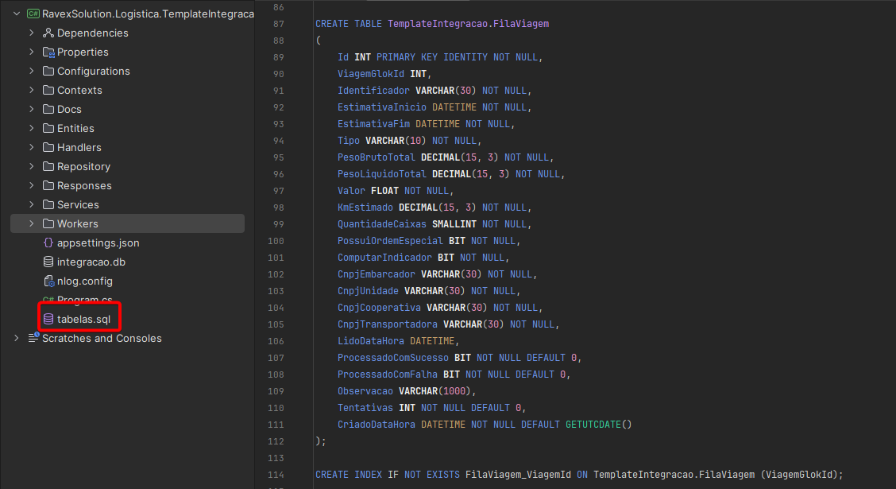

   - Nesse arquivo se encontram as tabelas de filas, que deverão ser criadas no banco de dados conforme configurado
     na `DefaultConnection` presente no arquivo `appsettings.json`.
   - Os nomes das tabelas e do esquema devem ser estritamente respeitados, do contrário, `o serviço não funcionará corretamente`.
   - Nas tabelas mencionadas anteriormente, será necessário preencher os campos com os dados que serão integrados em nosso sistema.
   - Ao final destas instruções, se encontra o diagrama de relacionamento entre as tabelas de nosso template de integração.
   - `Observação`: No arquivo se encontram os indices que auxiliam na otimização de cada tabela, caso queira utilizar.

## Funcionamento da integração

Para exemplificar o funcionamento da integração, utilizaremos a integração de viagens que se inicia no `IntegracaoViagemWorker`.

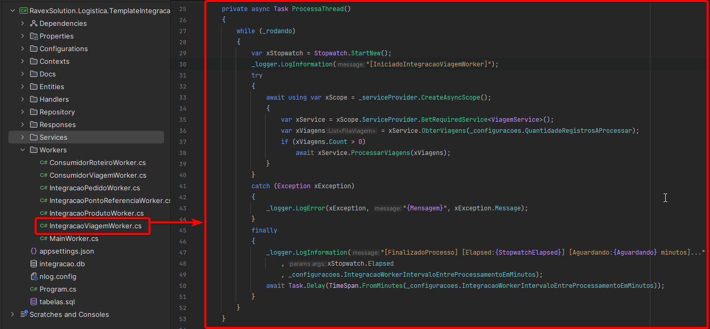

- Nela, encontra-se o método denominado `ProcessaThread`. Este método é responsável 
  pela execução periódica a cada 'x' minutos, sendo que 'x' representa o intervalo de processamento configurado no arquivo `appsettings.json`.
- Adicionalmente, o método também é encarregado de recuperar a quantidade de registros a serem buscados, 
  a qual também foi previamente configurada no arquivo `appsettings.json`.
- Após a obtenção da configuração, o método `ObterViagens` será acionado, este que será responsável por buscar as viagens da `Fila` de seu banco de dados, também
  previamente configurado no `appsettings.json`.

## Método ObterViagens

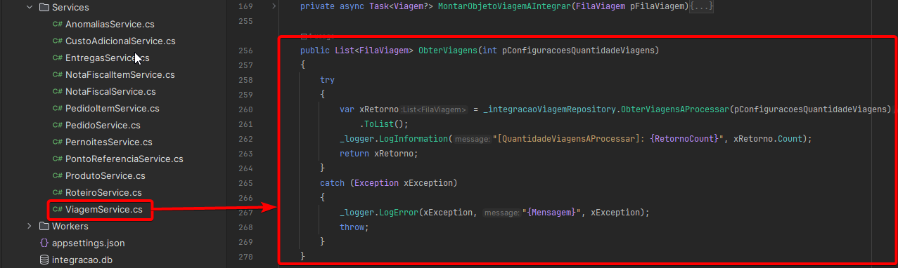

- Este método será responsável por realizar a busca de viagens presentes na fila, sendo essas:
  - Viagens na qual o número de tentativas de integração não tenha excedido o configurado no `appsettings.json`.
  - Viagens que não foram integradas com sucesso em nosso sistema.
  - Viagens que não possuem algum dado incorreto, pois em caso de erro na integração, o template marcará esta viagem como uma falha e não irá tentar integra-la novamente.
- Todas essas configurações podem ser vistas na imagem abaixo.

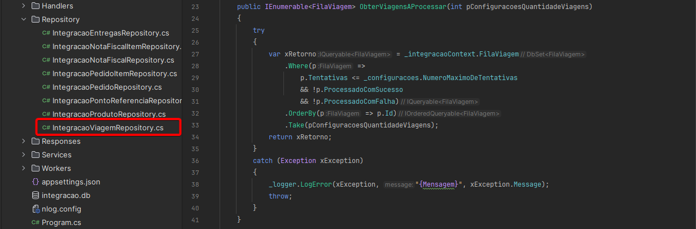

## Método ProcessarViagem

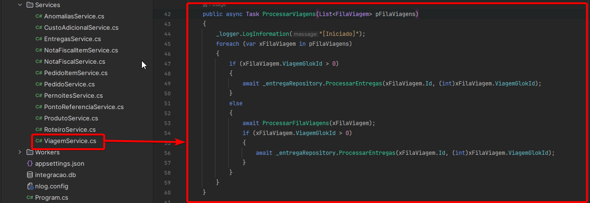

- Imediatamente após a obtenção das viagens, se houver pelo menos uma, este método de processamento integrará a viagem,
  desde que cumpra com as condições antes descritas.
- Se a viagem já tiver sido integrada, o método prosseguirá para a próxima etapa, que consiste na integração da entrega. 
- Este processo será realizado da mesma forma mencionada anteriormente (o mesmo procedimento se aplica à nota e ao item).
- O mesmo comportamento será executado em todos os outros workers de integração.
- `Observação:` Em caso de erro na integração devido a algum dado incorreto:
  - O sistema não tentará a integração novamente. 
  - Será necessário inserir um novo registro na fila de integração com o dado corrigido para que a tentativa de integração seja retomada.
  - Para consultar o erro, verifique a coluna `Observacao` presente nas tabelas das filas.

## Método ProcessarFilaViagem

- Esse método é responsável por realizar todas as etapas necessárias antes de enviar a nossa API e finalmente integrar a viagem em nosso sistema, além de realizar todas as devidas ações caso haja alguma complicação no dado que está sendo enviado ou em nossa API.
- nela se encontram os métodos `MontarObjetoViagemAIntegrar` e `IntegrarViagem`.

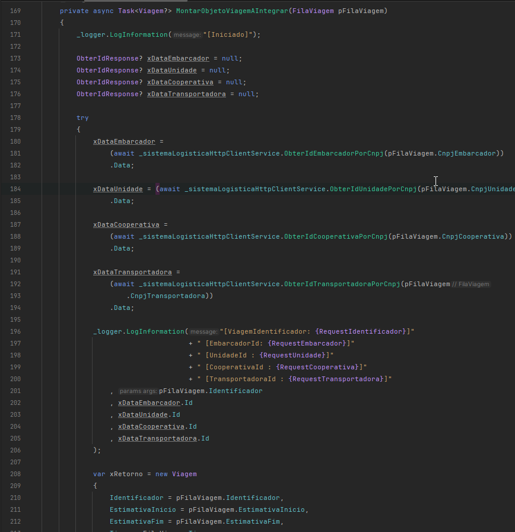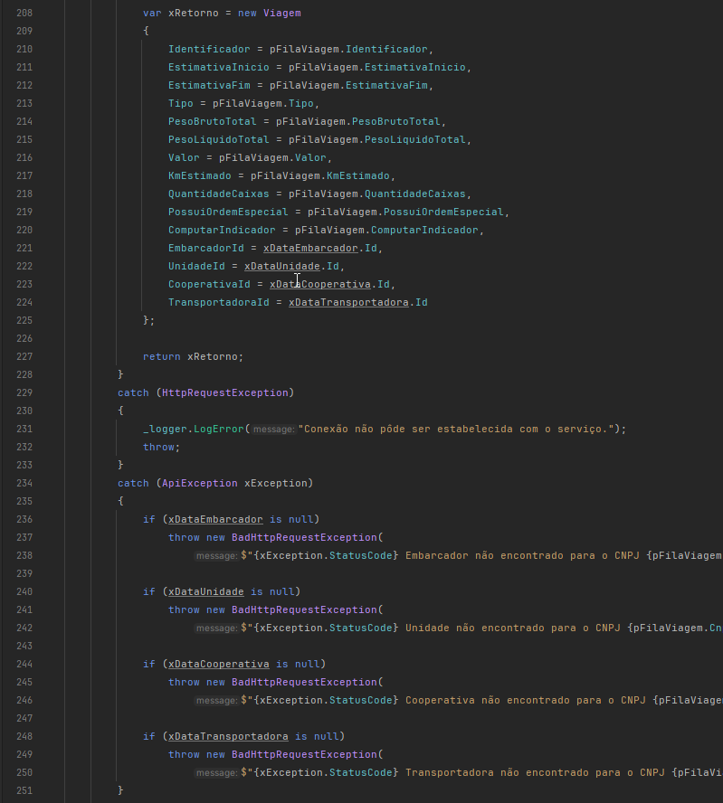

- O método `MontarObjetoViagemAIntegrar` é responsável por montar o objeto que será enviado para a API do Sistema Logístico para efetuar a integração,
  observe que alguns dados em específico ele faz uma busca, como o cnpj do embarcador, esse método irá acionar o método para obter o id do embarcador já criado na API do sistema logístico, caso ele não encontre, 
  isso gerará um erro que fará com que essa viagem não tente ser processada novamente, portanto cuidado.
- Em caso de sucesso, ao final do método `MontarObjetoViagemAIntegrar` ele retornará o objeto já com os dados corretos para enviar a API e o método `IntegrarViagem` será acionado.

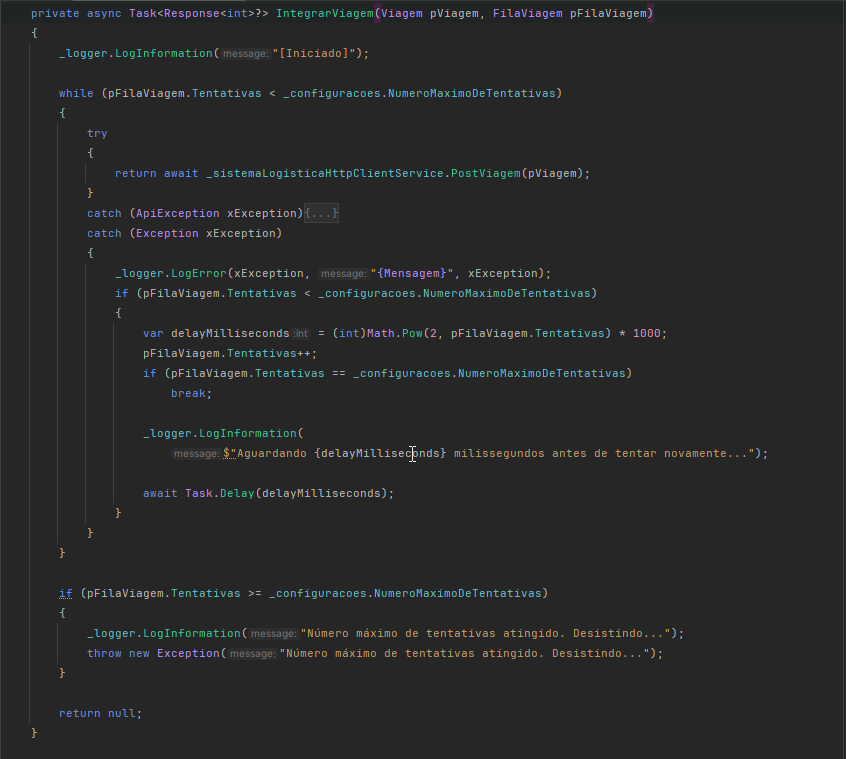

- Esse método é responsável por enviar o objeto já montado a API do Sistema Logístico para efetuar a integração.
- Em caso de sucesso, a viagem será integrada com sucesso em nosso sistema, além de atualiza-la na fila,
  preenchendo na mesma o Id integrado em nosso sistema e passando para a próxima etapa, que seria processar a entrega, onde o mesmo processo será repetido.
- Em caso de erro, como por exemplo nossa API estar fora por algum motivo, o template aplica um controle de tentativas, 
  onde ele tentará integrar a viagem novamente dentro de 'x' segundos e esse tempo é aumentado exponencialmente conforme o avanço do número de tentativas,
  caso ele exceda o número de tentativas configurado no `appsettings.json`, ele marcará a viagem como falha e não tentará mais integrar a mesma.

Ao final de todas as etapas, a viagem será integrada com sucesso em nosso sistema e passará para as próximas etapas que repetirão o mesmo comportamento na entrega, nota e item.

## Funcionamento dos métodos de buscas

Também disponibilizamos um exemplo de busca, com o worker `ViagemService`.

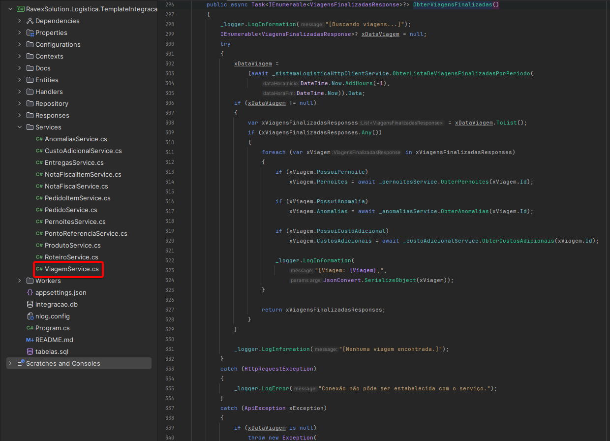

- O mesmo é responsável por acionar o método de `ObterViagensFinalizadas`.
- Esse método será responsável por buscar as viagens finalizadas na última hora.
- Se a viagem possuir pernoite, anomalia e/ou custo adicional, o método realizará as respectivas buscas.

## Diagrama de tabela das Filas de integração

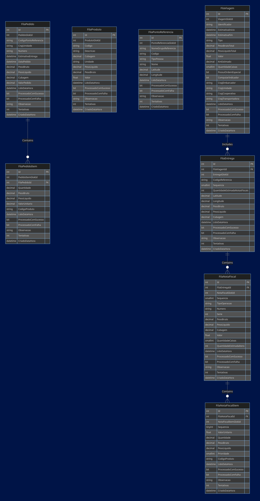